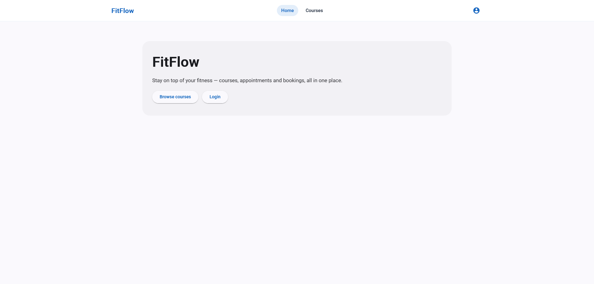
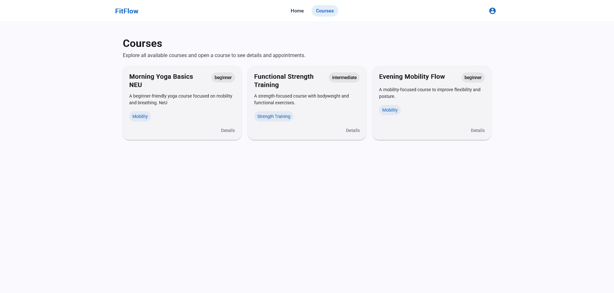
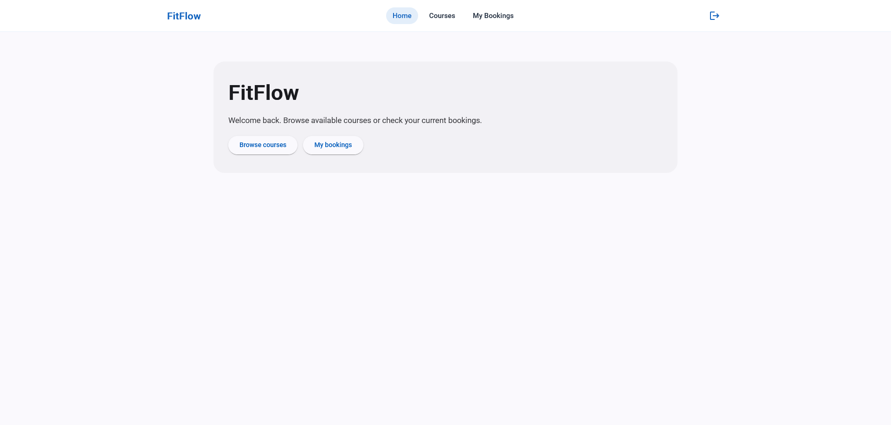
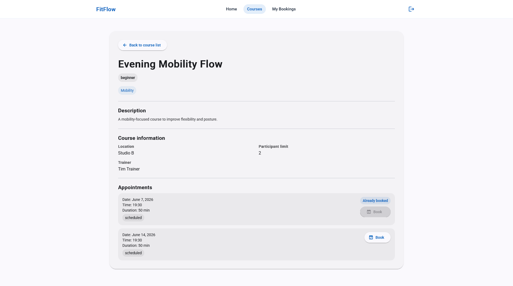
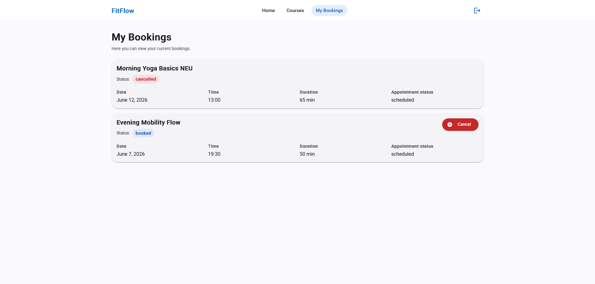
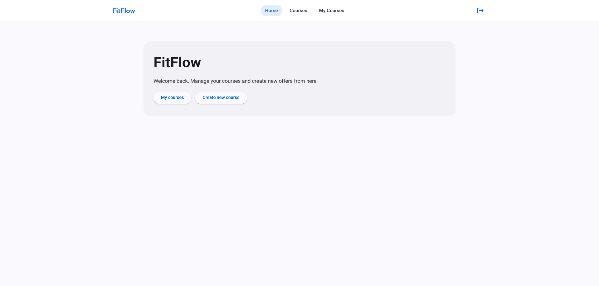
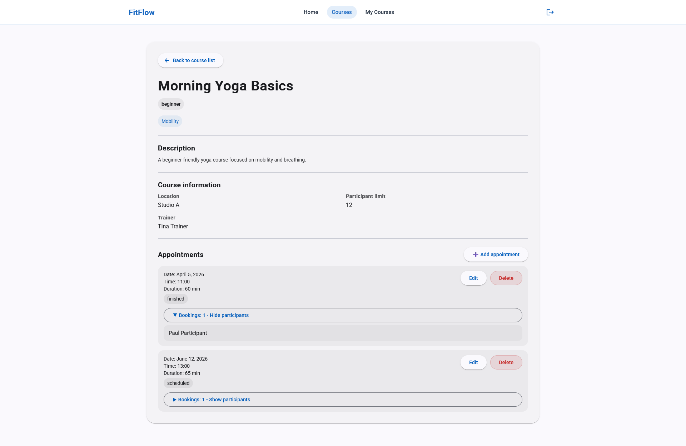
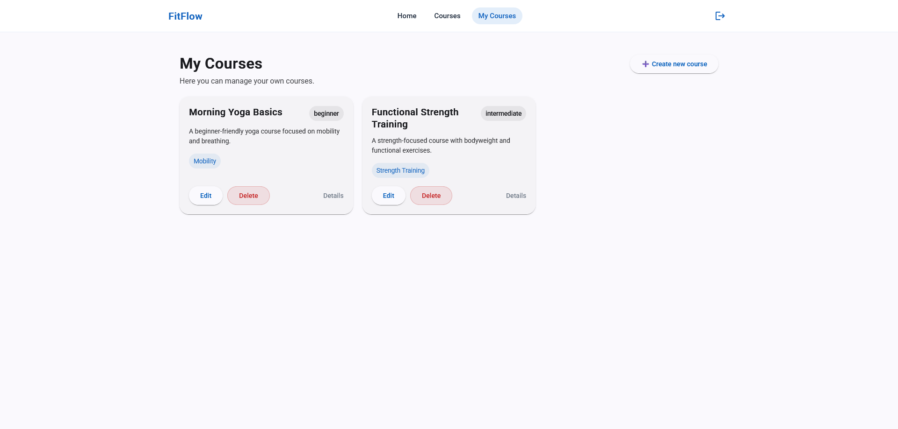
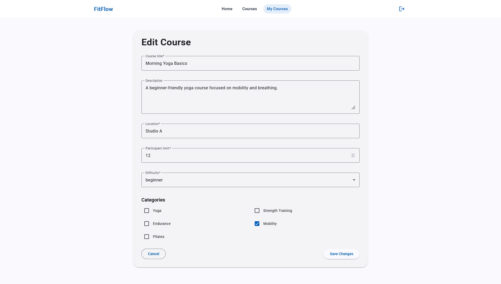
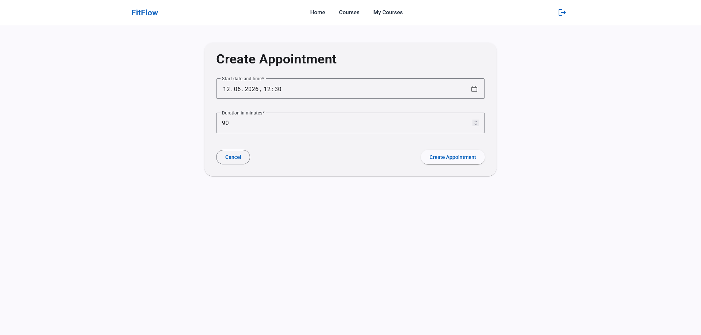

# FitFlow – Fitness Course Booking Platform

FitFlow is a full-stack web application for managing and booking fitness courses. It was developed as part of the course ‘Web Frameworks and Architectures’ during my Bachelor’s degree in Communication, Knowledge & Media at the University of Applied Sciences Upper Austria, Hagenberg Campus.

## About the Project

The application provides different functionalities depending on the user role:

* Participants can browse available fitness courses and book or cancel appointments.
* Trainers can create and manage their own courses and appointments.
* Visitors can view available courses and appointments without being logged in.

The project demonstrates the implementation of a frontend application, a RESTful backend API, authentication, role-based permissions and relational database structures.

## Features

* User authentication with JWT
* Role-based access for trainers and participants
* Course and appointment overview
* Booking and cancellation of appointments
* Trainer administration for own courses and appointments
* Validated Angular forms
* REST API communication between frontend and backend
* Seeded demo data for testing different user roles

## Tech Stack

### Frontend

* Angular
* TypeScript
* HTML
* SCSS
* Reactive Forms
* RxJS

### Backend

* Laravel
* PHP
* REST API
* JWT Authentication

### Database

* Relational database structure
* Laravel migrations and seeders

## Repository Structure

```text
client/fitnessapp26/   Angular frontend application
server/                 Laravel backend application
```

## My Contribution

This project was implemented by me as a full-stack web application. My work included the frontend implementation with Angular, backend development with Laravel, database modeling, API integration, authentication, role-based functionality and form validation.

## Screenshots

### Public views




### Participant views





### Trainer views







## Live Demo

A live demo is currently hosted on a university subdomain:

[Open Live Demo](http://fitflow.s2310456005.student.kwmhgb.at/home)

Please note that the university hosting may only be available until the completion of my degree in 2026. Screenshots and a short demonstration of the application are therefore included in this repository as a permanent project documentation.

## Local Setup

### Backend

```bash
cd server
composer install
cp .env.example .env
php artisan key:generate
php artisan migrate:fresh --seed
php artisan serve
```

### Frontend

```bash
cd client/fitnessapp26
npm install
ng serve
```

## Project Context

This application was created for educational purposes as part of a university course 'Web Frameworks and Architectures'.
